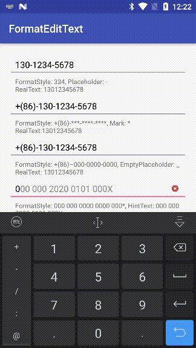

# FormatEditText
## [English](https://github.com/dkzwm/FormatEditText/blob/master/README_EN.md) | 中文

FormatEditText可以用来当做号码格式化文本输入框使用, 可以用来作为格式化手机号码、格式化身份证号码、格式化银行卡号码等.    

- 例如:指定模式为`MODE_SIMPLE`, 样式为`344`, 占位符为`-`, 手动依次输入`13012345678`, 那么最终会格式化为`130-1234-5678`, 且中间删除更改会自动补位.
- 例如:指定样式为`MODE_COMPLEX`, 样式为`***-****-****`, 标记符为`*`, 手动依次输入`13012345678`, 那么最终会格式化为`130-1234-5678`, 且中间删除更改会自动补位.
## 特性:
 - 支持配置格式化样式
 - 支持粘贴且光标自动跟随
 - 自动填充删除占位符

## 演示程序
下载 [Demo.apk](https://raw.githubusercontent.com/dkzwm/FormatEditText/master/demo/demo.apk)    
## 快照
</img>
## 引入
添加如下依赖到你的 build.gradle 文件:
```
dependencies {
    implementation 'me.dkzwm.widget.fet:core:0.0.6'
    AndroidX Kotlin版本
    implementation 'me.dkzwm.widget.fet:core:0.0.6.androidxKT'
}
```
## 使用
#### 在Xml中配置
```
//组合模式
<me.dkzwm.widget.fet.FormattedEditText
    android:layout_width="match_parent"
    android:layout_height="wrap_content"
    app:fet_formatStyle="+(**)-***-****-****"
    app:fet_mark="*"
    app:fet_mode="mode_complex"/>

//简单模式
<me.dkzwm.widget.fet.FormattedEditText
    android:layout_width="match_parent"
    android:layout_height="wrap_content"
    app:fet_formatStyle="344"
    app:fet_mode="mode_simple"
    app:fet_placeholder=" "/>
```
####  Java代码配置
```
//简单模式
FormattedEditText editText = findViewById(R.id.formattedEditText);
editText.setMode(FormattedEditText.MODE_SIMPLE);
editText.setFormatStyle("344");
editText.setPlaceholder(" ");（输入13012345678，格式化后为:130 1234 5678）
//组合模式
editText.setMode(FormattedEditText.MODE_SIMPLE);
editText.setMark("*");
editText.setFormatStyle("+(**)-***-****-****");（输入8613012345678，格式化后为:+(86)-130-1234-5678）
```
#### Xml属性 
|名称|类型|描述|
|:---:|:---:|:---:|
|fet_mode|enum|指定模式，支持`MODE_SIMPLE`（简单模式）和`MODE_COMPLEX`(组合模式)|
|fet_formatStyle|string|指定格式化样式，当`fet_mode`为`MODE_SIMPLE`时，格式只能是纯数字, `fet_mode`为`MODE_COMPLEX`时，格式为任意格式且需要指定`fet_mark`属性，如果不指定那么默认为`*`|
|fet_mark|string|指定标记符，仅当`fet_mode`为`MODE_COMPLEX`时需要设置，且长度必须为1（默认:`*`）|
|fet_placeholder|string|指定占位符，仅当`fet_mode`为`MODE_SIMPLE`时需要设置，且长度必须为1（默认:` `）|

## License
	--------

    	Copyright (c) 2017 dkzwm

	Permission is hereby granted, free of charge, to any person obtaining a copy
	of this software and associated documentation files (the "Software"), to deal
	in the Software without restriction, including without limitation the rights
	to use, copy, modify, merge, publish, distribute, sublicense, and/or sell
	copies of the Software, and to permit persons to whom the Software is
	furnished to do so, subject to the following conditions:

	The above copyright notice and this permission notice shall be included in all
	copies or substantial portions of the Software.

	THE SOFTWARE IS PROVIDED "AS IS", WITHOUT WARRANTY OF ANY KIND, EXPRESS OR
	IMPLIED, INCLUDING BUT NOT LIMITED TO THE WARRANTIES OF MERCHANTABILITY,
	FITNESS FOR A PARTICULAR PURPOSE AND NONINFRINGEMENT. IN NO EVENT SHALL THE
	AUTHORS OR COPYRIGHT HOLDERS BE LIABLE FOR ANY CLAIM, DAMAGES OR OTHER
	LIABILITY, WHETHER IN AN ACTION OF CONTRACT, TORT OR OTHERWISE, ARISING FROM,
	OUT OF OR IN CONNECTION WITH THE SOFTWARE OR THE USE OR OTHER DEALINGS IN THE
	SOFTWARE.
