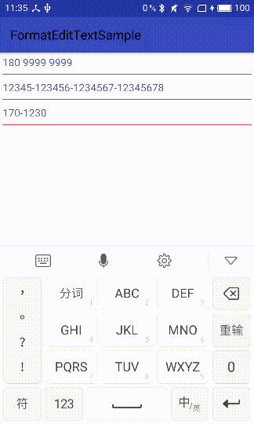

#FormatEditText
Two attributes
1.formatStyle such as "344";
2.placeHolder such as " ";

Can be used to format phone numbers like 3-4-4 format; such as "170 0000 0000";

##snapshot
####like this
</img>
